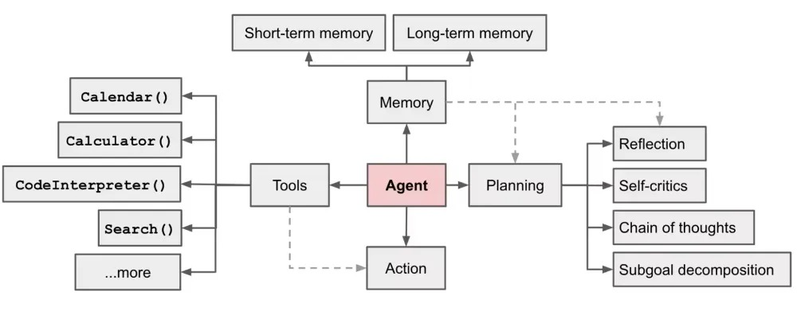
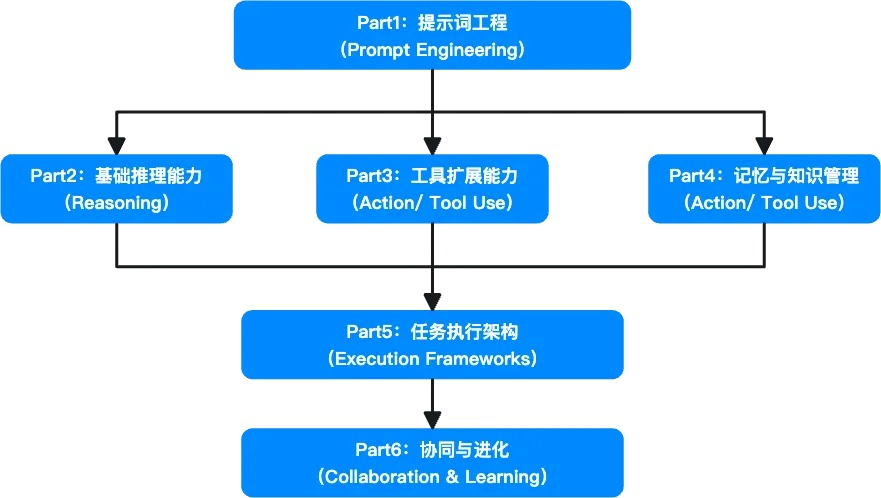
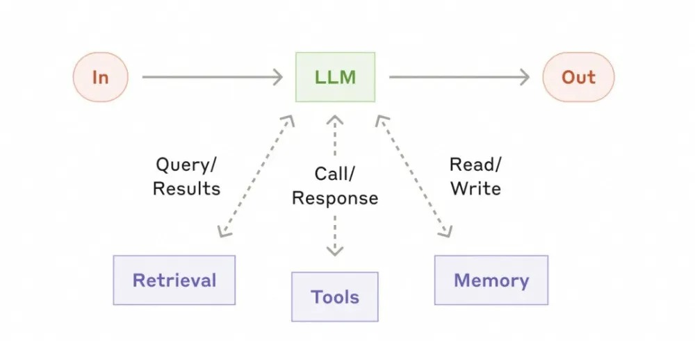
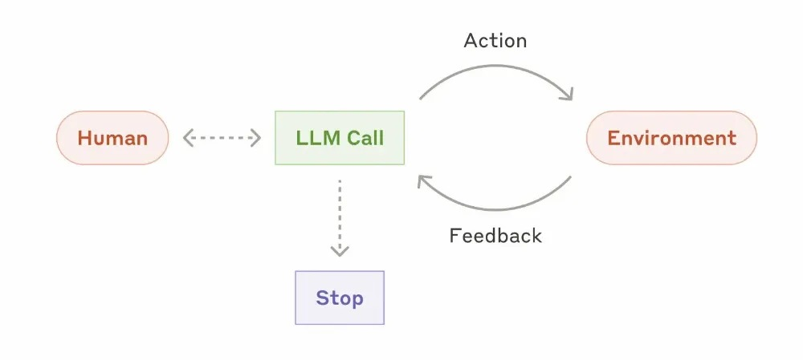

### 1. 软件范式演进

- 从Software 1.0（编写逻辑）到Software 2.0（数据驱动）再到Software 3.0（自然语言提示驱动），开发核心从"如何实现"转向"定义目标"。


### 2. 从LLM到Agent

- **AI Agent本质**：以LLM为认知核心，是具备自主行动能力的软件系统，=LLM (Reasoning) + Planning + Memory + Tool Use，从被动响应转变为主动规划与执行。

- **与LLM对比**：LLM是推理内核，被动；Agent是执行系统，主动，有状态，能感知、规划、决策、执行、学习。


### 3. Agent研发与传统研发区别

- **核心目标**：传统研发实现功能和逻辑，Agent研发实现高级目标和自主行为。

- **思维模型**：传统是命令式，Agent是目标导向式。

- **主要产出物**：传统是源代码等，Agent是架构、Prompt等。

- **研发模式等**：传统是计划驱动，Agent是实验驱动；协作方式、调试方法、结果评判标准、控制流、迭代核心均不同。

### 4. Agent基础知识

- **Planning**：将目标拆解为子任务并调整策略。

- **Memory**：存储、检索和管理信息，包括短期和长期记忆。

- **Tools**：连接数字世界的接口，如联网、计算等。

- **Action**：规划和工具使用的最终执行。



### 5. 关键技术点


关于Agent的开发，首先的开发就是提升词工程，角色设定，样本的多少，输出的格式化这三个是主要的，接下俩就是推理的模式，怎么串联这些LLM来达成我的目的，是思维链呢，还是树，还是图，下次一个就是需不需要调用工具，fuctioncall, mcp, skills, rules, 在一个就是需不需要外挂知识库来做记忆的管理，最后选定任务执行架构，是React, plan-execut , 还是Reflexing, 这是三种，这已经基本可以完成一个Agent的开发了，不过按照现在的发现多Agent有可能成为主流，让Agent与Agent对话来达成用户的目的或者多个agent来做，例如cc, 他的核心就是Agent是大脑，让一个Agent规划，派生一系列子agent来做目标，最后一个Agent code ，一个Agent统筹多个Agent来做。

#### Part1：提示词工程（Prompt Engineering）

*   关键点：角色设定 (Role Prompting)

	说明：为 LLM 设定一个明确的专业领域角色，可以激活模型内部相关的垂直领域知识分布，使其输出内容的专业术语、视角和行为模式与设定角色保持一致，从而提升在特定领域任务中的表现。

示例：大促商品文案审核 Agent

```
你现在是电商平台内容安全团队的资深审核专家，精通最新的广告法和平台营销规范。你的任务是审查商家提交的双11大促商品短标题和营销文案。
审查重点：绝对化用语（如"第一"、"顶级"）、虚假比价（如"原价999，现价9.9"无依据）、诱导欺诈（如"点击领红包"实则引流）。
请以严谨、专业的口吻给出审计报告，指出违规内容、风险等级 (高/中/低) 和具体的合规修改建议。
```


- 关键点：零样本/少样本提示（Zero/Few-Shot）

	说明：利用模型的上下文学习 能力。零样本提示直接下达指令；少样本提示则是提供若干个Input-Output 示例，引导模型模仿示例的模式。通过提供高质量的示例，可以让模型快速适应特定的业务场景和任务要求。

示例：商品标题生成 Agent

```
你是一个资深的电商文案专家。你的任务是根据提供的商品关键属性，生成简洁、吸引人且符合SEO规范的商品标题。
标题应包含品牌、核心卖点、适用人群/场景等关键信息，长度控制在 30-60 个字符之间。

Few-Shot Examples:

Input:
{
    "brand": "Apple",
    "model": "iPhone 15 Pro",
    "color": "原色钛金属",
    "storage": "256GB",
    "features": ["A17 Pro芯片", "4800万像素主摄", "USB-C接口"]
}
Output:
"Apple iPhone 15 Pro (256GB) 原色钛金属 移动联通电信5G手机 A17 Pro芯片"

```


- 关键点：输出格式化

	说明：结合显式的格式约束指令（如要求输出特定 Schema 的 JSON、XML、Markdown 等），可以强制模型生成可被下游系统解析的结构化数据，而非自由文本。

示例：商品属性自动化抽取 Agent

```
你是一个智能商品信息结构化助手。任务是从非结构化的商品详情描述中，提取出关键属性值，并严格按照指定的 JSON Schema 输出。不要包含任何 JSON 以外的内容。

[Schema Definition]
{
    "type": "object",
    "properties": {
        "brand": {
            "type": "string",
            "description": "品牌名称"
        },
        "model": {
            "type": "string",
            "description": "具体型号"
        }
    },
    "required": ["brand"]
}

User Input:
"全新阿迪达斯三叶草系列休闲鞋，牛皮帮面，经典贝壳头设计，情侣款，出街必备。"

Model Output:
{
    "brand": "阿迪达斯",
    "model": "三叶草系列休闲鞋"
}

```


- 关键点：工具使用提示模板

	说明：一种标准化的 Prompt 设计模式，用于向 LLM 描述外部可用工具（API、函数）的能力。模板通常包含工具名称、功能描述、参数列表以及使用示例。

示例：库存查询工具定义 Agent

```
# Available Tools

You have access to the following tools:

## `query_sku_inventory(sku_id: str, warehouse_code: str = "MAIN_WH") -> int`

- **Description**:
  Use this tool to check the current available inventory quantity of a specific SKU in a given warehouse.

- **Parameters**:
  - `sku_id`: The unique identifier of the Stock Keeping Unit (e.g., "SKU_887799").
  - `warehouse_code`: The code of the warehouse to query. Defaults to "MAIN_WH".

- **Usage Example**:
  To check inventory for SKU 'SKU_123' in the bonded warehouse, call `query_sku_inventory(sku_id="SKU_123", warehouse_code="BONDED_WH")`.
```


- 关键点：自我一致性/自我优化提示

	说明：自我一致性：利用 LLM 生成结果的随机性，对同一问题并行生成多个不同的推理路径和答案，然后通过多数投票机制选择最一致的结果，从而提高复杂推理任务的准确性。

	自我优化提示：一种迭代优化机制。先让模型生成一个初步结果，然后将该结果作为输入反馈给模型，并要求模型对其进行评估、批判和改进，从而生成质量更高的最终结果。

示例：大促商品文案生成与优化 Agent

```
Task:
"为一款即将参加双11大促的'智能降噪耳机'撰写一条吸引人的商品短标题，要求突出降噪效果和优惠信息。"

Self-Consistency Strategy:
Prompt 模型生成 5 条不同的短标题草案，例如：
- "双11直降！智能降噪耳机，静享好声音"
- "强力降噪，沉浸体验，双11特惠来袭"
- "静无止境，智能降噪耳机双11半价抢"

Self-Refine Strategy:
Initial Output: "静无止境，智能降噪耳机双11半价抢"
Refine Prompt: "这条标题虽然突出了降噪和优惠，但略显平淡，不够吸引眼球。请优化。"
Refined Output: "🔥双11炸场价！智能降噪耳机【半价】秒杀，一秒入静，手慢无！🚀"
```

工程挑战与应对方法

| 挑战点      | 现象描述                                                                                                | 应对方法                                                                                                                  |
| -------- | --------------------------------------------------------------------------------------------------- | --------------------------------------------------------------------------------------------------------------------- |
| 输出结构不稳定性 | 模型生成的 JSON/XML 等结构化数据可能包含语法错误                                  | 鲁棒解析与重试机制：采用容错能力强的解析器；建立自动反馈机制 |
| 指令依从性衰退  | 在长上下文窗口中，模型可能会"忘记" System Prompt 中设定的关键约束条件                            | 提示强化：在多轮交互的关键节点简要重申最核心的约束指令 |

#### Part2：基础推理能力（Reasoning）

打破 LLM "直觉式"回答，通过特定的 Prompt 技术让其进行逻辑严密、分步骤的"慢思考"，解决涉及多环节计算、规则判定和路径规划的复杂问题。


- 关键点：**思维链** (CoT, Chain-of-Thought)

	说明：通过在提示中加入引导（如 "Let's think step by step"），促使 LLM 显式地生成一系列中间推理步骤，而不是直接输出最终答案。

示例：复杂订单价格计算 Agent

```
Task:
"用户订单含商品A (100元), B (200元), C (50元)。用户有'满300减30'平台券、'B商品立减20'单品券、500京豆（抵5元）。请计算最终应付金额。"

CoT Output:
Let's calculate the order price step by step.

1. **Calculate Initial Total**:
   商品总价 = 100 (A) + 200 (B) + 50 (C) = 350 元。

2. **Apply Item-Level Discount**:
   应用'B商品立减20'单品券。
   新的商品总价 = 100 (A) + 180 (B) + 50 (C) = 330 元。

3. **Apply Platform Discount**:
   当前总价 330 >= 300，满足'满300减30'。
   应用平台券后总价 = 330 - 30 = 300 元。

4. **Apply Virtual Currency**:
   应用 500 京豆抵扣 5 元。
   最终应付金额 = 300 - 5 = 295 元。

```

- 关键点：思维树 (ToT, Tree of Thoughts)

	说明：对于解决空间巨大或需要规划的复杂问题，ToT 框架允许 Agent 在思维空间中探索多条可能的路径。

示例：大促物流履约路径规划 Agent

```
Task:
"双11期间，针对华东地区的爆品订单，设计一个兼顾时效和成本的仓配履约方案。"

ToT Process:

Thought 1 (分支一: 极致时效):
    Proposal: 全部从上海中心仓发货，使用顺丰特快。
    Evaluation: 时效最优，但成本极高，且中心仓压力巨大。
    评分: 6/10。

Thought 2 (分支二: 成本优先):
    Proposal: 启用华东地区所有前置仓就近发货。
    Evaluation: 成本最低，但前置仓库存深度不足。
    评分: 7/10。

Thought 3 (分支三: 分层履约):
    Proposal: 根据用户画像分层。高价值用户从中心仓发顺丰；普通用户就近发货。
    Evaluation: 平衡了体验和成本，复杂度可控。
    评分: 9/10。

Decision: 选择分支三进行详细方案设计。
```

- 关键点：**思维图** (GoT, Graph of Thoughts)

	说明：将推理过程建模为有向图结构，是 ToT 的泛化形式。思维节点可以分叉、合并、循环。

示例：新商品冷启动营销策略制定 Agent

```
Task: "为一款新发布的中高端扫地机器人制定冷启动营销策略。"

GoT Process:

Node A (市场分析): 分析竞品价格带和功能差异。
Node B (目标用户画像): 定义核心受众为"一线城市养宠家庭"。
Node C (渠道策略): 提出多渠道方案：站内搜索广告 + 小红书种草 + 直播带货。
Node D (内容策略): 提出主打"吸毛发不缠绕"和"静音"的卖点。
Aggregation Node E (策略融合): 将 A, B, C, D 的信息融合。
```

- 关键点：**自我反思** (Self-Reflection)

	说明：要求 Agent 在生成初步结果后，暂时跳出当前任务视角，扮演一个独立的"批评者"角色。

示例：智能客服回答质检 Agent

```
User Question: "为什么我的快递三天了还没动？"

Initial Agent Output: "亲，大促期间物流比较慢，请您耐心等待。"

Reflection Trigger: "请检查你的回答是否具备同理心，是否提供了具体的订单状态信息。"

Revised Answer: "亲，非常抱歉给您带来不好的体验。我刚帮您查询了订单（单号：SF123456），目前包裹已到达【杭州转运中心】，预计明天能送到您手中。"
```

#### Part3：工具扩展能力（Action / Tool Use）

打破 LLM 的数字边界，通过标准化接口使其能够查询数据、生成报告等。

- 关键点：Function Calling

	说明：一种使 LLM 能够与外部系统交互的机制。开发者提供可用函数的结构化定义。

示例：智能客服退换货处理 Agent

```
Tool Definition (Schema):
{
    "name": "apply_for_return",
    "description": "为用户的指定订单申请退货服务。",
    "parameters": {
        "type": "object",
        "properties": {
            "order_id": { "type": "string", "description": "订单号" },
            "return_reason": { "type": "string", "enum": ["quality_issue", "wrong_item"] }
        },
        "required": ["order_id", "return_reason"]
    }
}

交互流程:
User: "我买的鞋子码数不对，订单号是 889900，我想退货。"
Agent: 调用 apply_for_return 工具。
Host Program: 调用售后中心 API，成功提交申请。
Agent Final Response: "好的，已为您申请退货服务。快递员预计明天上午联系您取件。"
```

- 关键点：Model Context Protocol (MCP)

	说明：一种标准化的开放协议，旨在统一 LLM Agent 与外部世界的交互方式。

示例：统一商品信息管理 Agent

```
场景: 电商平台商品信息分散在多个系统中
- 基础信息在 MySQL 数据库
- 图片和视频在 OSS 对象存储
- 库存和价格在 Redis 缓存

应用: 通过 MCP，这些异构的数据源被封装为统一的资源接口。
Agent 只需通过标准的 MCP 指令：
- read_resource("product://base/sku_123")
- read_resource("product://media/sku_123")
```

- 关键点：Claude Skills

	说明：一种模块专业化机制，允许为模型"安装"特定领域的专家能力包。

示例：电商平台资损防控 Skill Agent

```
/ecommerce_loss_prevention/
├── SKILL.md                          # 技能说明书
├── tools/
│   ├── check_activity_conflict.py    # 检查营销活动互斥规则
│   └── validate_pricing_rule.py      # 验证价格配置是否合规
├── knowledge/
│   └── loss_prevention_rules_v2.json # 最新资损防控规则库
└── prompt_template.yaml              # 领域专属 Prompt 模板
```

- 关键点：代码解释器 (Code Interpreter / Sandbox)

	说明：为 LLM 提供一个安全的、隔离的编程环境（沙箱）。

示例：商家经营数据分析助手 Agent

```
User Task: "帮我分析一下店铺上个月的销售数据，找出销售额最高的 Top 5 商品，并画一个饼图。"

Agent Action:
编写 Python 代码，使用 pandas 读取 CSV，按商品 ID 分组汇总销售额，排序取 Top 5。

Agent Final Response: "上个月销售额 Top 5 的商品分别是 [商品A, 商品B, ...]。饼图已生成。"
```

#### Part4：记忆与知识管理（Memory）

为 Agent 构建一个可持久化、可检索的存储系统，整合外部知识。

- 关键点：检索增强生成 (RAG, Retrieval-Augmented Generation)

	说明：一种结合了信息检索和语言生成的技术框架。

示例：平台商家规则咨询助手 Agent

```
背景: 商家经常咨询复杂的平台发货时效和处罚规则。

RAG Process:
Indexing: 将《电商平台商家发货管理规范.pdf》切片并 Embedding 存入向量库。
User Query: "我是经营生鲜类目的，春节期间的发货时效要求是什么？"
Retrieval: 系统检索到规范中关于"特殊品类（生鲜）发货要求"的相关段落。
Generation: Agent 基于检索到的规则原文，准确回答商家。
```

- 关键点：对话上下文管理

	说明：在多轮交互中维护和管理对话状态的机制。

示例：多轮导购对话 Agent

```
策略: 采用实体记忆 (Entity Memory) 策略。

Process:
在对话过程中，持续从用户的语句中提取关键购物意图实体
（如 "需求: 跑步鞋", "品牌: 耐克", "预算: 500左右"），
存储在结构化的状态中。
在每一轮推荐时，都基于当前积累的所有实体状态调用搜索服务。
```

- 关键点：反思与经验记忆

	说明：一种让 Agent 从过往经历中学习的机制。

示例：大促活动配置经验积累 Agent

```
场景: 去年双11，因未考虑到预售定金膨胀与店铺券叠加的互斥规则，导致计价 Bug。

Memory Store: 事后存储一条经验：
{
    "task_type": "activity_config",
    "scenario": "presale_and_coupon",
    "reflection": "配置预售活动时，必须先检查与现有店铺券的叠加互斥规则。"
}

New Task: 今年618配置类似活动时。
Action: Agent 检索到这条经验，主动先调用接口检查互斥规则，避免了同样的问题。
```

#### Part5：任务执行架构（Execution Frameworks）

作为Agent 的"控制中枢"，包括组织推理、工具、记忆等能力，形成完整的任务执行策略。

- 关键点：ReAct (Reason + Act)

	说明：一种流行的 Agent 执行范式，它将推理和行动交织在一个密集的循环中。

示例：全网比价与购买决策 Agent

```
Task: "帮我买一个全网最便宜的国行 Switch OLED 主机。"

Loop 1:
    Thought: 需在主要电商平台搜索商品价格。
    Action: 调用京东、天猫、拼多多搜索 API。
    Observation: 获得各平台价格列表和商家信息。

Loop 2:
    Thought: 初步筛选出价格最低的几个链接。需要核实是否为"国行"、"全新"、"正品"。
    Action: 调用商品详情和评价查询 API。
    Observation: 发现最低价的链接是港版，京东自营确定是国行正品。

Loop 3:
    Thought: 综合考虑价格和信任度，京东自营是符合要求的最低价。
    Final Answer: "推荐购买京东自营的链接，价格稍高但能确保国行全新正品。"
```

- 关键点：规划与执行分离 (Plan-and-Execute)

	说明：一种处理复杂长流程任务的架构。

示例：新商家入驻流程自动化 Agent

```
Task: "协助一家新企业商家完成平台入驻流程。"

Phase 1: Planning:
1. 收集企业资质文件（营业执照、法人身份证）。
2. 调用工商 API 核验资质真实性。
3. 引导商家填写店铺基础信息。
4. 提交平台人工审核。
5. 审核通过后，协助商家缴纳保证金并激活店铺。

Phase 2: Execution:
Executor Agent: 顺序执行计划。
```

- 关键点：Reflexion (带反思的执行框架)

	说明：在标准的 Agent 执行循环中明确嵌入反思机制。

示例：精准营销人群圈选 Agent

```
Task: "为一款高端母婴产品圈选一波目标用户进行营销触达。"

Execution: Agent 初次圈选了"过去30天浏览过母婴频道的女性"。营销效果不佳。

Reflexion: Agent 反思认为，浏览行为太宽泛，未排除已购买用户。
应该增加"高消费力标签"和"近3个月未购买同类目商品"的过滤条件。

Retry: 基于反思更新圈选条件，重新执行任务，提升营销ROI。
```

#### Part6：协同与进化（Collaboration & Learning）

突破单 Agent 能力边界，实现协作与自主进化。

- 关键点：Multi-Agent

	说明：模拟人类组织的协作模式，将复杂任务分解并分配给多个具有不同角色的独立 Agent。

示例：全链路故障定位 Agent

```
Agent 角色定义:

故障协调 Agent: 负责接收故障报警，创建故障工单，协调各专业 Agent 进行排查。

应用服务故障定位 Agent: 专注于应用层面的故障排查，分析应用日志、Trace 调用链。

RPC 接口故障定位 Agent: 专门负责 RPC 接口层面的故障诊断。

数据库故障定位 Agent: 深入数据库层面进行故障排查。

协作流程:
1. 故障协调 Agent 立即响应，创建故障工单。
2. 应用服务故障定位 Agent 分析 Trace 调用链，发现订单创建接口调用库存服务超时。
3. RPC 接口故障定位 Agent 进一步分析，确认库存服务的 RPC 接口延迟极高。
4. 数据库故障定位 Agent 深入分析库存数据库，发现存在大量的行锁等待。
5. 故障协调 Agent 将各 Agent 的排查结果汇总，得出最终结论。
```

- 关键点：Agent RL

	说明：将 Agent 置于一个可交互的环境中，使其通过试错来学习最优策略的方法。

示例：个性化推荐策略优化 Agent

```
Environment: 电商推荐系统仿真环境。
State: 用户当前特征、上下文信息、候选商品池。
Action: 选择一种推荐策略或调整排序公式的参数。
Reward: 根据模拟用户的反馈计算奖励（点击 +1 分，下单 +10 分）。
Learning: Agent 通过大量模拟交互，利用强化学习算法不断调整策略。
```

### 6. Agent工程实践

- **研发流程**: 核心关注点从"功能实现"到"目标达成"，流程驱动力从"计划驱动"到"实验驱动"。

- **设计范式**:
    - **最小可用范式**：适合轻交互场景，有单轮触发、线性流程、无状态设计等特点。
    
    - **工作流式**：由开发者预定义流程，有预定义执行路径等特点。
    - **动态规划类**：依赖大模型运行时自主推理编排。
    

### 7. 个人实践体会

- 从"最小可用范式"开始，压榨架构潜力，渐进式复杂，遵循"奥卡姆剃刀"。

- 混合架构是落地常态，"工作流外壳 + 智能内核 + 知识管理"，避免Agent失控。

- 智能是奢侈品，稳定是必需品，在智能、可控和成本找到最优平衡点。

- 没有银弹，AI极大地消除了次要困难，但无法解决根本困难，对人要求更高。

- Agent参与者都需要深度理解业务，无论对于架构设计和prompt工程都非常重要。

- 领域知识壁垒比想象中高，包括来自平台沉淀和专家积累等，关注质量和持续性。

- 无评估，不迭代，无数据，不优化，不能用感觉效果不错代替量化验证。

- Agent能力+用户体验（过渡/重做）=好Agent产品。

- 拉长时间看，在特定范围内Agent比人更可靠，Agent会成为团队的一份子。
